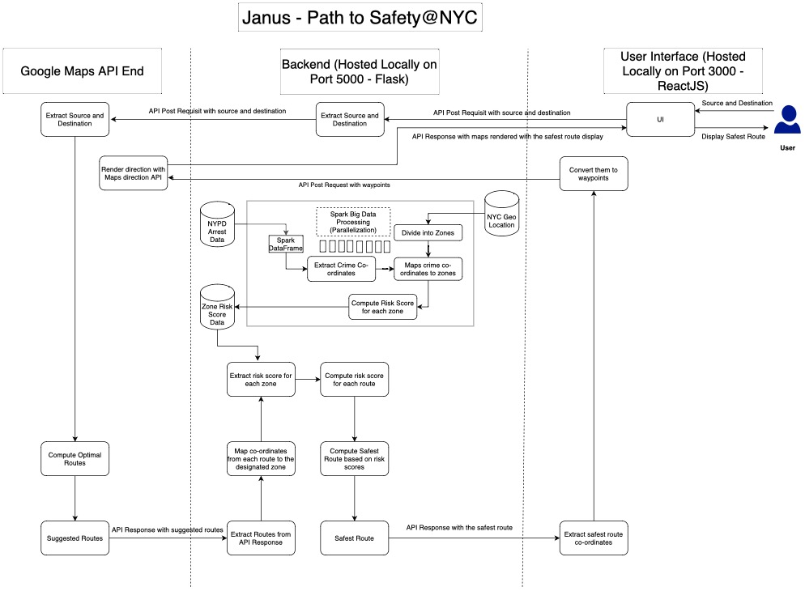

# Janus-BigData
Safest Path to walk from one point to another in New York

Tasks:
- [x] load data and filter
- [x] NYU's range for lat, long => create the zone table  {big data}
- [x] calculate risk score for each zone => {big data}
- [x] user types source and destination on front end
- [x] GET API -> backend => {routes with risk score, distance and time}
- [x] front end part
- [x] architecture diagram 

Step to run project-
Run Flask App:
1. cd backend
2. python -m venv venv
3. source venv/bin/activate
4. Install Flask, flask_restful, flask_cors, googlemaps libraries using pip install
5. run the command: "flask run" to run the flask app.

Run React-Native App:
1. open another terminal and cd to frontend
2. npm install
3. npm start