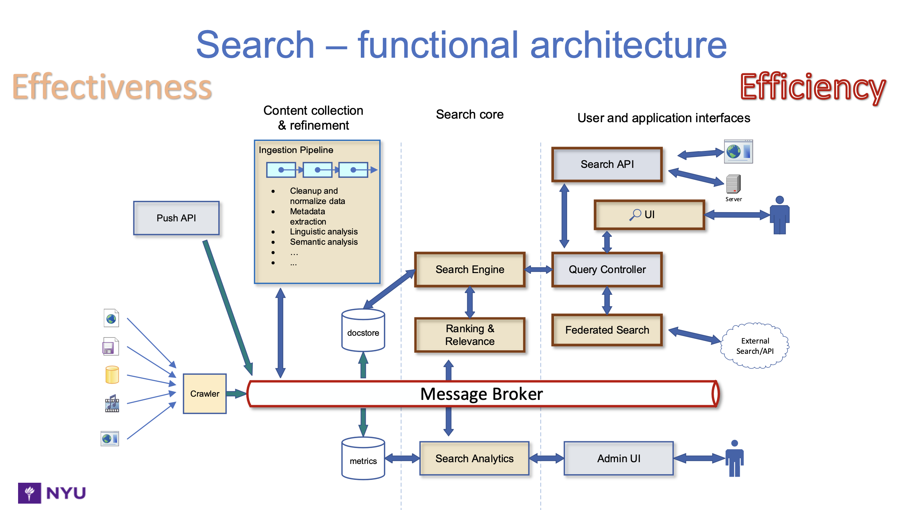

# Janus-BigData
Safest Path to walk from one point to another in New York

Tasks:
- [x] load data and filter
- [x] NYU's range for lat, long => create the zone table  {big data}
- [x] calculate risk score for each zone => {big data}
- [x] user types source and destination on front end
- [x] GET API -> backend => {routes with risk score, distance and time}
- [x] front end part
- [ ] architecture diagram 

Step to run project-
1. cd backend
2. python -m venv venv
2. source venv/bin/activate
